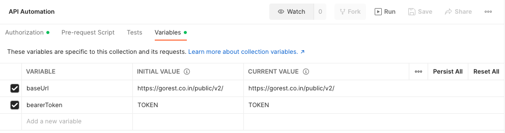
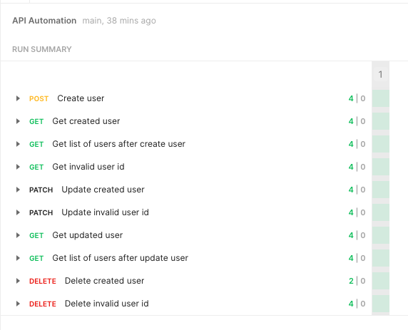

# API Automation Test

Requirements:

- Use https://gorest.co.in/
- Choose one of available endpoints
- Automate the testing of endpoint via a Postman collection(s)
- Provide the readme to the solution

## Installation

After cloning the project in your local environment you should follow these steps:

1. Open Postman application.
2. Click on the "Import" button.
3. Select the "File" tab.
4. Click on the "Upload Files" button.
5. Go to the path where you cloned the repository.
6. Select the postman collection (Collection v2.1).
7. Click on the "Open" button.
8. The postman collection should be imported in your postman local environment.

## Configuration

To successfully run the API automation tests on Postman, you should first set the bearer token as a value variable:

1. Open https://gorest.co.in/consumer/login
2. Login with any of the options provided.
3. Copy the provided bearer token.
4. Open Postman application.
5. Click on the imported collection name (API Automation).
6. Select the "Variables" tab.
7. On the "bearerToken" variable, paste the copied bearer token on the "Initial Value" and "Current Value" (Replace those "TOKEN" values).
   
8. Save changes.

## Test Execution

To run the test execution follow these steps:

1. Open Postman application.
2. Click on the imported collection name (API Automation).
3. Click on the "Run" button (between the "Fork" and "Save" buttons).
4. Verify that all the requests are selected.
5. Change the iteration to any number or keep it as default "1".
6. Click on "Run API Automation".
7. Wait for the execution to finish and take a look at the results.

