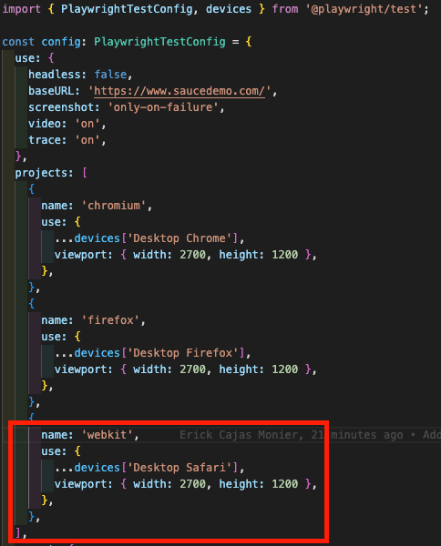
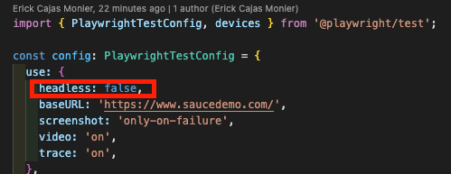
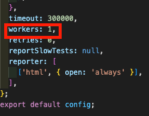
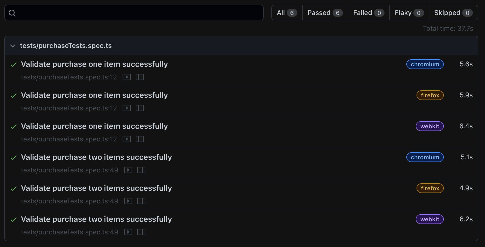

# UI Automation Test

Challenge requirements:

- Use https://gorest.co.in/
- Choose one of available endpoints.
- Automate the testing of endpoint via a Postman collection(s).
- Provide the readme to the solution.

## System requirements:

- Nodejs +v16: I recommend using Nodejs v18.x
- npm v8.x

## Setup Configuration:

After cloning the project in your local environment you should follow these steps:

1. Open the project folder in your IDE (VS Code is usefull).
2. Open the terminal (in your IDE or by separate) and position it inside the `UI Test` folder.
3. To install the required packages, execute the command:
    ```bash
    npm i
    ```
4. To install the supported browsers (Chrome, Firefox, Safari), execute the command:
    ```bash
    npx playwright install
    ```
5. In case you are not in a macbook and for some reason Safari is not working locally after installing the supported browsers via command, please comment the `webkit` project in the `playwright.config.ts` file.
   
6. In case you don't want to see the browsers during the tests execution (enable headless mode), change the headless configuration from `false` to `true` in the `playwright.config.ts` file.

   
7. The test execution is configured to execute tests sequentially, in any case you want to test it in parallel please increase the workers number from `1` to `3` in the `playwright.config.ts` file.

   

**:warning: Important note: The HTML report is configured to be opened by default after the test execution finishes, it contains videos, traces, steps, statuses and screenshots in case of a failure.**

## Test Execution

To run the test execution follow these steps:

1. Open the project folder in your IDE (VS Code is usefull).
2. Open the terminal (in your IDE or by separate) and position it inside the `UI Test` folder.
3. To run the tests, execute the command:
    ```bash
    npx playwright test
    ```
4. When the test execution finishes, an HTML report file will be opened by default to show the test results.
   

**:warning: Important note: The tests include snapshot comparison, in any case the images to compare are different from the current images (this can be due to the operation system that is being used), execute the following command:**
```bash
npx playwright test --update-snapshots
```
